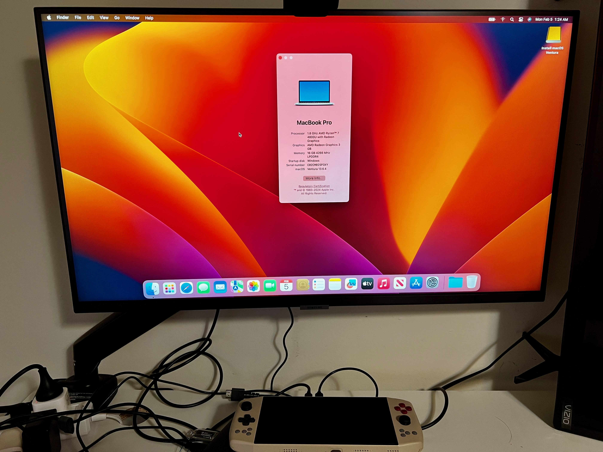
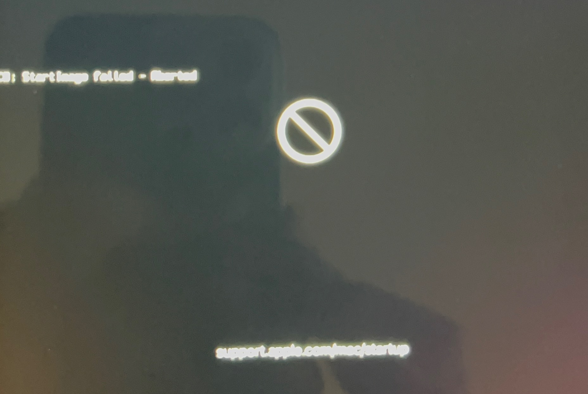
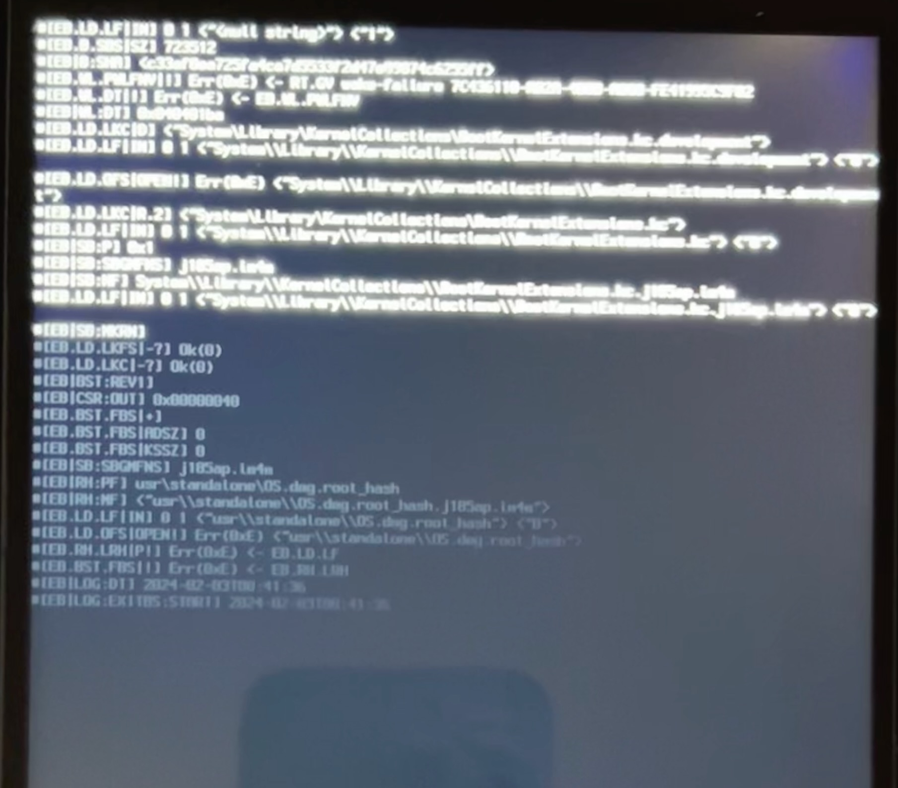

# Ayaneo 2021 Pro Handheld Console OpenCore EFI for macOS Ventura

<!-- add github tags here -->

<!-- insert picture at the center with 50% scale -->

  

## Features

* Support Bluetooth 4.0+ devices with the solution provided by [this issue](https://github.com/OpenIntelWireless/IntelBluetoothFirmware/issues/51). 
* Resolve the booting loop issue by following the [reddit post](https://www.reddit.com/r/hackintosh/comments/p5hezn/big_sur_115_stuck_at_eblogresetrecovery_use/).
* Can drive two external displays without issue. 

## Hardware

* **CPU**: AMD Ryzen 7 4800U
* **iGPU**: AMD Radeon Graphics (Vega 8)
* **Memory**: 16 GB LPDDR4X 4266 MHz
* **Storage**: 1T WD SN530 NVMe SSD
* **Display**: External 4k 60Hz via USB-C

## Current Status

| Component | Status | Notes |
| --------- | ------ | ----- |
| CPU | ✅ | |
| iGPU | ✅ | Driving two external displays without issue with `NootedRed` |
| Audio | ✅ | |
| USB | ✅ | |
| Battery | ✅ | |
| Bluetooth | ✅ | |
| Sleep | ✅ | Cannot wake up from sleep. |
| Graphics Acceleration | ⚠️ | Hardware video decoding is not working. Known issue for AMD iGPU. |
| WiFi | ❌ | Seems a common issue for this chipset. Tried `itlwm` but get kernel panic. |

## Installation

**OpenCore**: Please follow the [OpenCore guide](https://dortania.github.io/OpenCore-Install-Guide/installer-guide/) to create a bootable USB. Then replace the `EFI` folder with mine.

**BIOS**: Disable Secure Boot and Fast Boot

> ⚠️ This Machine behaves strangely when booting from USB. It may take several tries to boot into the installer. It is common to see the following error. Just keep trying by rebooting the machine. (The `TM` key in the console can do the reboot quickly.)

## Troubleshooting

* **Boot Loop**: If you encounter the boot loop issue, please follow the [reddit post](https://www.reddit.com/r/hackintosh/comments/p5hezn/big_sur_115_stuck_at_eblogresetrecovery_use/).
* **Cannot boot into the installer**: It is common to see the following error. Just keep trying by rebooting the machine. (The error should look like the following. Try 2-10 times to boot into the installer or the machine. )

| **Boot Error** | **Error Log** |
| ------------- | ------------- |
|  |  |